# Linux basics
## Part 1. Installation of the OS
- Installed __Ubuntu 20.04 Server LTS__ without GUI (using __VirtualBox__)
- Checked Ubuntu version by running the command `cat /etc/issue`:  
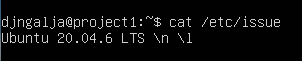

## Part 2. Creating a user
- Created a new user __galja__ and added the user to __adm__ group:  
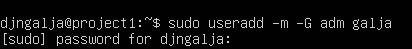  
- The new user is found in the output of the command `cat /etc/passwd`:  
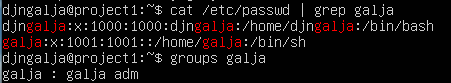  
- `groups` displays the groups the specified user belongs to.

## Part 3. Setting up the OS network
__1. Set the machine name as user-1.__ 
- Set the name using `sudo hostnamectl set-hostname user-1`:  
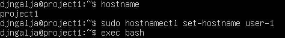  

__2. Set the time zone corresponding to your current location.__
- Set the time zone using `sudo timedatectl set-timezone Europe/Moscow`:  
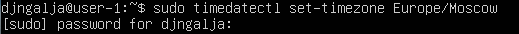  
- New time zone in the `timedatectl` output:  
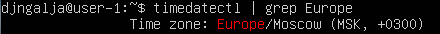  

__3. Output the names of the network interfaces using a console command.__
- Using `ip -c link` displayed all network interfaces:  
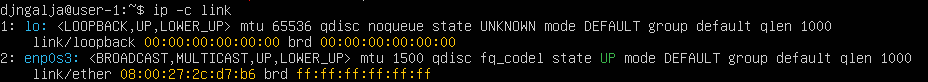  
- __lo__ (loopback device) exists almost on every __Linux__ machine. This is a virtual interface which usually uses 127.0.0.1 address. It can be used by applications to communicate with each other on the same machine. It is also used in troubleshooting.

__4. Use the console command to get the ip address of the device you are working on from the DHCP server.__
- Got the address using `ip addr show enp0s3`:  
  
- The Dynamic Host Configuration Protocol (__DHCP__) is used for automatically assigning IP addresses to devices connected to the network.

__5. Define and display the external ip address of the gateway (ip) and the internal IP address of the gateway, aka default ip address (gw).__
- Displayed the internal gateway IP using `ip route show`:  
  
- Found the external gateway IP using `curl ifconfig.me; echo`.

__6. Set static (manually set, not received from DHCP server) ip, gw, dns settings (use public DNS servers, e.g. 1.1.1.1 or 8.8.8.8).__
- In order to set them manually, edited `/etc/netplan/00-installer-config.yaml`. The original file:  
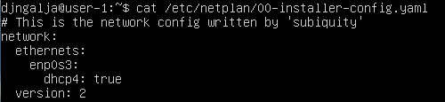  
- Edited the file using __nano__. Saved the file and applied changes using `sudo netplan apply`: 
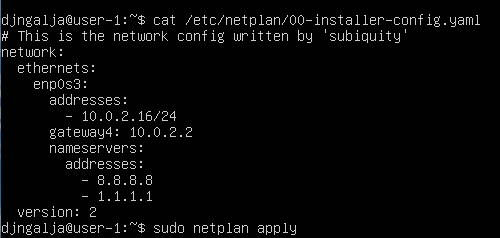  

__7. Reboot the virtual machine. Make sure that the static network settings (ip, gw, dns) correspond to those set in the previous point.__
- After rebooting the virtual machine, checked the IP address:  
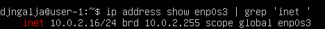  
- Checked the inner gateway IP (gw):  
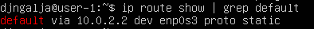  
- Checked the contents of `/etc/netplan/00-installer-config.yaml`.
- Succesfully pinged a remote host __1.1.1.1__ using `ping`:  
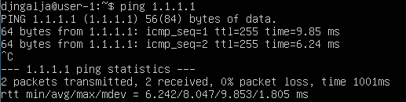

## Part 4. OS Update
- Downloaded the latest information about available packages using `sudo apt update`.  
- Installed the updates for each outdated package using `sudo apt upgrade`.
- Entered the `sudo apt update` command again to check that no updates are available:  
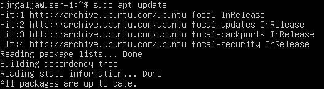

## Part 5. Using the __sudo__ command
- The __sudo__ command allows users to execute commands with administrative privileges in Linux, without logging in as the __root__ user. 
- Allowed user __galja__ created in [Part 2](#part-2-creating-a-user) to execute __sudo__ command by adding the user to __sudo__ group: `sudo usermod -aG sudo galja`. Displayed all the groups the user belongs to:  
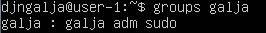  
- Set a password for the user using `sudo passwd galja`. 
- Changed user using `su - galja`.
- Checked the user change by running `whoami`.
- Changed __hostname__ via user __galja__ using `sudo hostnamectl set-hostname user`.
- Checked the __hostname__ change from __user-1__ to __user__ by running `hostname` command.  
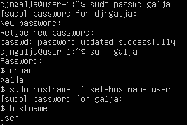

## Part 6. Installing and configuring the time service
- To set up automatic time synchronisation service, it was necessary to disable the standard utility first. Checked its status (__active__) using `systemctl status systemd-timesyncd.service`.  
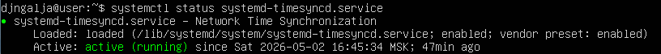  
- Disabled the utility using `systemctl stop systemd-timesyncd.service` and `systemctl disable systemd-timesyncd.service`:
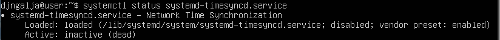  
- After making sure the system was up to date, installed __NTP__ by running `sudo apt install ntp`. The __NTP__ status can be checked using `systemctl status ntp`:  
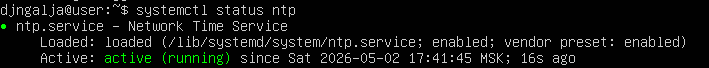  
- By running `timedatectl show`, made sure that  __NTPSynchronized=yes__ and the time was displayed correctly:  
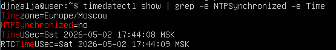

## Part 7. Installing and using text editors
__1. Install __VIM__ text editor (+ any two others if you like __NANO__, __MCEDIT__, __JOE__ etc.)__
- Installed __VIM, NANO, JOE__ using `sudo apt install <text editor name>`. 

__2. Using each of the three selected editors, create a *test_X.txt* file, where X is the name of the editor in which the file is created. Write your nickname in it, close the file and save the changes.__
- Created a new file using `vim test_vim.txt`. Typed my nickname in the file. To save the changes and close the file, pressed the `Esc` key to enter normal mode, typed `:wq` and pressed `Enter`.  
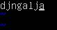  
- Created a new file using `nano test_nano.txt`. Typed my nickname in the file and saved it bt pressing `Ctrl+o`. Closed the file by pressing `Ctrl+x`.  
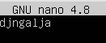  
- Created a new file using `joe test_joe.txt`. Typed my nickname in the file and pressed `Ctrl+k x` to save the changes and quit.  
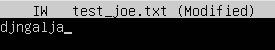  

__3. Using each of the three selected editors, open the file for editing, edit the file by replacing the nickname with the "123 text 123" string, close the file without saving the changes.__
- Opened the file`test_vim.txt` for editing. Replaced the nickname with the line __123 text 123__. Closed the file without saving the changes by entering normal mode and typing `:q!`.  
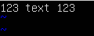  
- Opened the file`test_nano.txt` for editing. Replaced the nickname with the line __123 text 123__. Closed the file without saving the changes using `Ctrl+x`. Additionally typed `N`.  
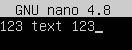  
- Opened the file`test_joe.txt` for editing. Replaced the nickname with the line __123 text 123__. Closed the file without saving the changes using `Ctrl+c`. Additionally typed `y`. 
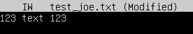  

__4. Using each of the three selected editors, edit the file again (similar to the previous point) and then master the functions of searching through the contents of a file (a word) and replacing a word with any other one.__
- Edited the file `test_vim.txt` again. Switched to normal mode and typed `/text` to find this word:  
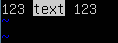  
- Replaced the word __text__ with __TEXT__ in the file `test_vim.txt` using `:s/text/TEXT` in normal mode:  
  
- Edited the file `test_nano.txt` again. To find the word __text__ used `Ctrl+w` and typed the word __text__:  
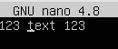  
- Replaced the word __text__ with __TEXT__ in the file `test_nano.txt`. To do this, pressed `Ctrl+\` and entered __text__, __TEXT__ and __y__:  
 
  
- Edited the file `test_joe.txt` again. To find the word __text__, used `Ctrl+k f` and then selected the option `i`. 
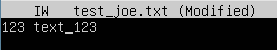  
- Replaced the word __text__ with __TEXT__ in the file `test_joe.txt`. To do this, pressed `Ctrl+k f`, entered the word __text__, selected the option `r`, entered the replacement __TEXT__ and confirmed (__y__):  
  
  
  

## Part 8. Installing and basic setup of the __SSHD__ service
__1. Install the SSHd service.__
- Installed __SSHd__ service by running `sudo apt install openssh-server` and confirming changes (`y`). Checked the status of the service to make sure it was properly installed using `systemctl status ssh`:  
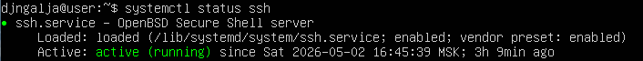  

__2. Add an auto-start of the service whenever the system boots.__
- Restarted the system with `sudo reboot` to make sure the service starts automatically when the system boots. Otherwise, this command could be used: `sudo systemctl enable --now ssh`.

__3. Reset the SSHd service to port 2022.__
- To change the port number, used `sudo nano /etc/ssh/sshd_config` to open the file specified in the command. Uncommented and edited the port line:  
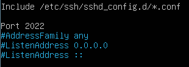  
- Saved and closed the file. Restarted the sshd service using `sudo systemctl restart ssh`.
- Checked the changes using `systemctl status ssh`.  

__4. Show the presence of the sshd process using the ps command. To do this, you need to match the keys to the command.__
- The __ps__ command displays the list of processes as a table. To make sure the  __sshd__ process is present, used `ps -A | grep sshd`:   
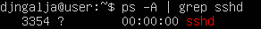  
- The __-A__ option is necessary to display all processes.  

__5. Reboot the system.__
- Rebooted the system by running `sudo reboot`. 
- Installed __netstat__ by running `sudo apt install net-tools`.
- The output of `netstat -tan`:  
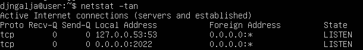  
- Output columns:
  - <ins>Proto</ins> — The protocol used by the socket
  - <ins>Recv-Q</ins> — The count of bytes not copied by the user program connected to this socket
  - <ins>Send-Q</ins> — The count of bytes not acknowledged by the remote host.
  - <ins>Local Address</ins> — Address and port number of the local end of the socket. __0.0.0.0 means that the port is listening on all network interfaces__
  - <ins>Foreign Address</ins> — Address and port number of the remote end of the socket. If the port is not yet established, its number is shown as an asterisk (\*). __0.0.0.0:* indicates everyone and all ports in the IP space__
  - <ins>State</ins> — The state of the socket. LISTEN means listening for a connection request
- __netstat__ options:
  - <ins>-t</ins> — TCP
  - <ins>-a</ins> — show both listening and non-listening sockets
  - <ins>-n</ins> — show addresses and ports in numerical form

## Part 9. Installing and using the __top__, __htop__ utilities
__1. top utility__
- Using __top__ utility, determined:
  - <ins>uptime</ins> — 35 minutes
  - <ins>number of authorised users</ins> — 1
  - <ins>average system load</ins> — 0.00 (a minute ago), 0.00 (5 minutes ago), 0.00 (15 minutes ago)
  - <ins>total number of processes</ins> — 95
  - <ins>cpu load</ins> — 0.0 us (user processes), 0.0 sy (system processes), 0.0 ni (priority adjusted processes)
  - <ins>memory load</ins> — 1952.8 total, 1445.8 free, 151.3 used, 355.7 buff/cache
- Using `top -o RES`, sorted the output by memory. Thus, additionally determined <ins>pid of the process with the highest memory usage</ins> — 680:  
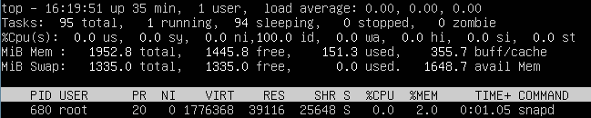  
- Using `top -o %CPU`, sorted the output by CPU usage. Thus, additionally determined <ins>pid of the process taking the most CPU time</ins> — 3634:  
  

__2. htop utility__
- __htop__ can be installed by running `sudo apt install htop`. 
- Using __F6__, sorted the output by:
  - <ins>PID</ins>:  
  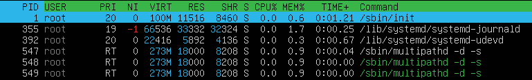  
  - <ins>PERCENT_CPU</ins>:  
  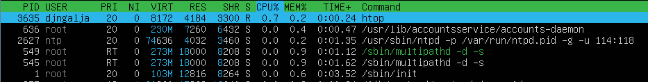  
  - <ins>PERCENT_MEM</ins>:  
  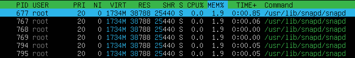  
  - <ins>TIME</ins>:  
  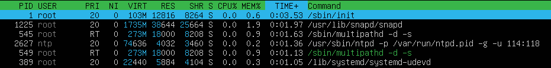  
- Using __F4__ filtering, found the __sshd__ process:  
  
- Using __F3__ searching, found the __syslog__ process(pressing __F3__ again allows to go through other matches):  
  
- Using __F2__, added __hostname__, __clock__ and __uptime__ to the output:  
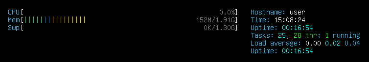  

## Part 10. Using the __fdisk__ utility
- Using `sudo fdisk -l`, displayed: 
  - <ins>hard disk name</ins> — /dev/sda
  - <ins>hard disk capacity</ins> — 10 GiB
  - <ins>number of sectors</ins> — 20971520  

    
- The __swap__ size can be found using __top__ and __htop__ utilities from [Part 9](#part-9-installing-and-using-the-top-htop-utilities) as well as by running `swapon --show`:  
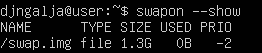  

## Part 11. Using the __df__ utility
- Displayed the disk space usage of mounted file sistems by running `df`. By default, disk usage is displayed in __1К__ blocks. For the root directory (/): 
  - <ins>partition size</ins> — 7865580
  - <ins>space used</ins> — 4065580
  - <ins>space free</ins> — 3378776
  - <ins>percentage used</ins> — 55%  

  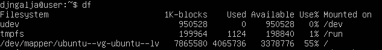  
- The `-h` option is used to display disk usage in human-readable format (KB, MB, GB). To display the type of file system, the `-T` option can be used. Thus, for the root directory (/):
  - <ins>partition size</ins> — 7.6GB
  - <ins>space used</ins> — 3.9GB
  - <ins>space free</ins> — 3.3GB
  - <ins>percentage used</ins> — 55%
  - <ins> file system type</ins> — ext4
 
  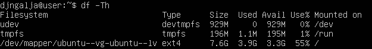  

## Part 12. Using the __du__ utility
__1. Run the du command.__  
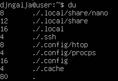  

__2. Output the size of the /home, /var, /var/log folders (in bytes, in human readable format).__
- The `-b` option is used to display sizes in bytes. The `-h` option displays sizes in human-readable format, using units such as KB, MB, GB, etc. The `-s` option is necessary to display the total size of the directory:  

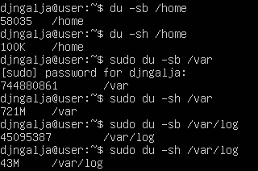  

__3. Output the size of all contents in /var/log (not the total, but each nested element using *).__
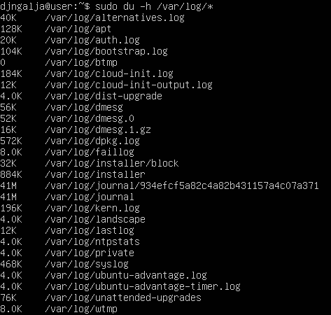  

## Part 13. Installing and using the __ncdu__ utility
- Installed the __ncdu__ utility by running `sudo apt install ncdu`.
- Using `ncdu --color dark /home`, output the size of __/home__. The resulting size is similar to the one obtained in [Part 12](#part-12-using-the-du-utility):  
  
- Using `sudo ncdu --color dark /var`, output the size of __/var__. The resulting size matches the one obtained in [Part 12](#part-12-using-the-du-utility). __sudo__ allows to take into account the size of all files in the directory, even if the user has no access to them. Without __sudo__, the resulting size and the number of files would be smaller.  
  
- Using `sudo ncdu --color dark /var/log`, output the size of __/var/log__. The resulting size matches the one obtained in [Part 12](#part-12-using-the-du-utility):  
  

## Part 14. Working with system logs
- __/var/log/dmesg__ — Contains low-level kernel messages from the ring buffer, useful for diagnosing hardware failures, driver issues and boot problems. Using `tail -n 5 /var/log/dmesg`, displayed the last 5 lines of the file:  
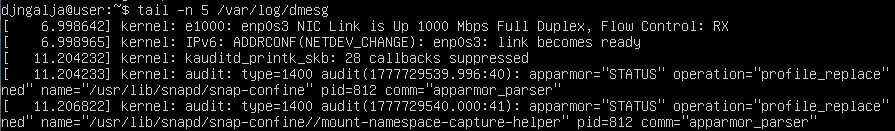  
- __/var/log/syslog__ — Contains all message logs except for authentication messages. Using `tail -n 5 /var/log/syslog`, displayed the last 5 lines of the file:  
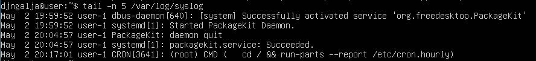  
- __/var/log/auth.log__ — Contains system authorization information, including user logins and authentication mechanisms that were used. Using `tail -n 5 /var/log/auth.log`, displayed the last 5 lines of the file:  
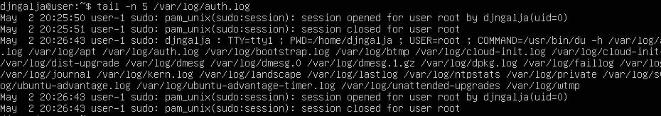  
- The `last` command can be used to display a list of user login and logout sessions. To limit the number of login entries to display, the `-n` option can be used:
  - <ins>the last successful login time</ins> — 2 May, 16:47
  - <ins>user name</ins> — djngalja
  - <ins>login method</ins> — console login (tty1)  

  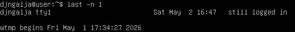  
- Using `sudo systemctl restart sshd`, restarted __SSHd__ service. The service restart message can be found in the logs by running `tail /var/log/auth.log | grep sshd`:  
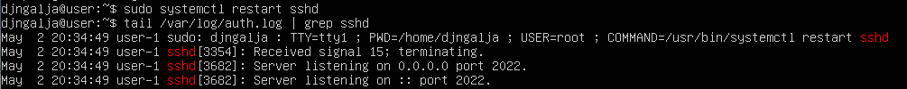  

## Part 15. Using the __CRON__ job scheduler
- Using the `crontab -l` command, checked for scheduled tasks for the current user. None were found. 
- Using `crontab -e`, created a new file and added the line `*/2 * * * * uptime` to run the __uptime__ command every 2 minutes. Saved the file.
- Entries about the task execution can be found in the system logs, by running the command `tail n -6 /var/log/syslog`:  
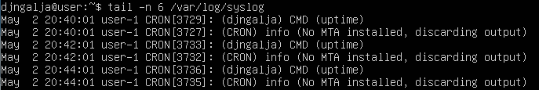  
- Checked for scheduled tasks again using `crontab -l`:  
  
- Removed all tasks from the job scheduler by running `crontab -r`. Made sure the tasks were removed using `crontab -l`:  
