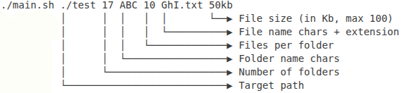
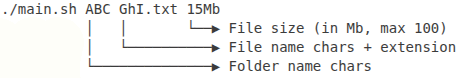
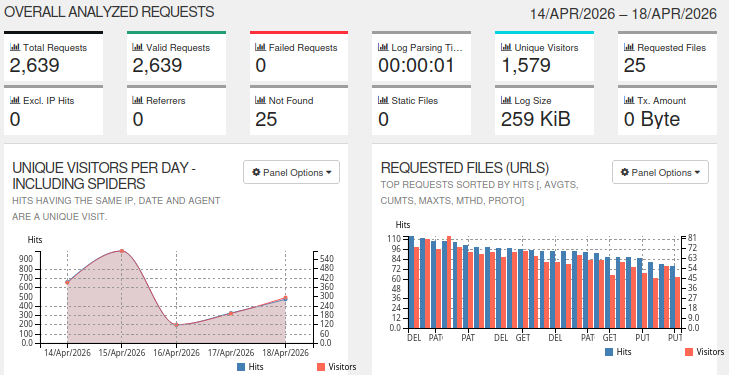
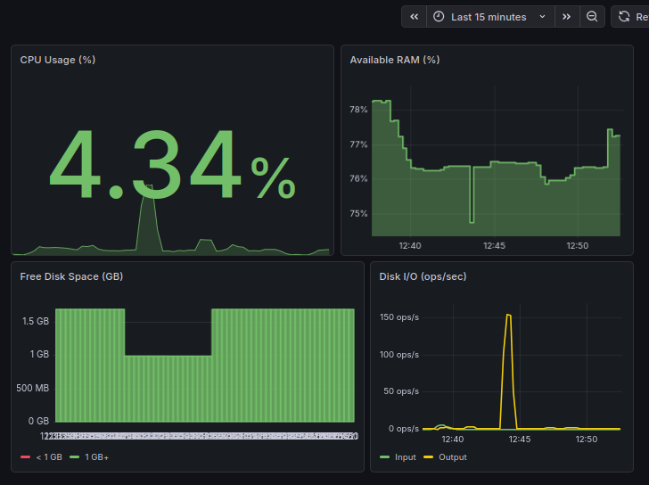
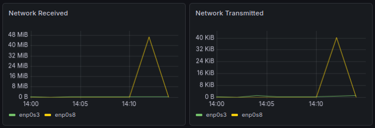
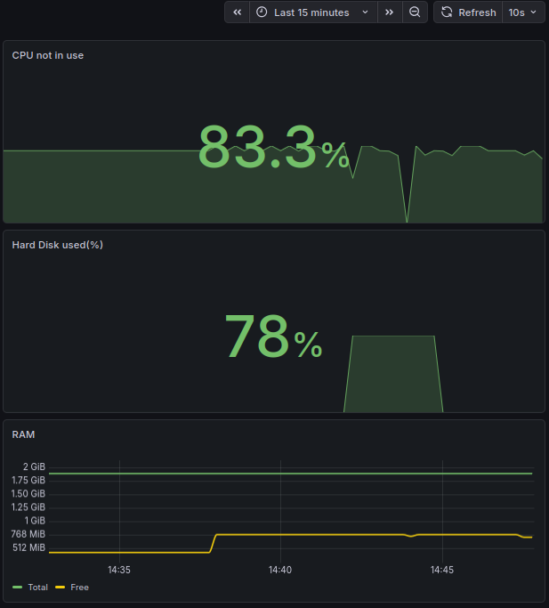

# Linux Monitoring
My solutions to a system monitoring assignment, tested on _Ubuntu Server 20.04 LTS_. 

## ex01. File generator

A bash script that generates directories and fills them with files:
- Uses given character sets (e.g. `ABC`) for names
- __Naming rules__: min 4 chars + `_DDMMYY`(e.g. `ABCC_080526`), preserves char order (`baaa` invalid if `ab` given)
- Terminates automatically at 1GB free space threshold  
- Logs every created file/directory (path, timestamp, file size) <br />

__Usage example__: <br />


## ex02. Filesystem Clogger

A bash script that fills the system with files across multiple locations until only 1GB of free space remains:
- Uses `INIT_DIR` (a variable in `main.sh`, defaulting to `./TEST`) as the base for generating directories
- Creates up to 100 directiories in multiple locations, __never__ in paths containing `bin` or `sbin`
- Generates a different number of files (up to 100) in each directory 
- Uses given character sets (e.g. `ABC`) for names
- __Naming rules__: min 4 chars + `_DDMMYY`(e.g. `ABCC_080526`), preserves char order (`baaa` invalid if `ab` given)
- Terminates automatically at 1GB free space threshold  
- Logs every created file/directory (path, timestamp, file size) 
- Prints and logs its start time, end time and total runtime<br />

__Usage example__: <br />


## ex03. Cleanup Utility

A bash script that deletes files and directories created by `ex02`.

__Usage example__:
```
./main.sh 1    # Uses LOG_PATH (default: ../ex02/file_generator.log)
./main.sh 2    # Cleans from INIT_DIR (default: ../ex02/TEST, prompts for time)
./main.sh 3    # Pattern match in INIT_DIR ([A-Za-z]+_[0-9]{6})
```

## ex04. Nginx Log Generator

A bash script that generates 5 Nginx log files (1 per day) in combined format.
- Generates 100 - 1000 entries per day with chronologically ordered timestamps
- Uses real status codes, HTTP methods, user agents and IPs

__Usage example__:
```
./main.sh    # Generates 5 log files
```

## ex05. Nginx Log Analyzer

A bash script that parses Nginx logs created by `ex04` using `awk`.

__Usage example__:
```
./main.sh 1    # Outputs entries sorted by status codes
./main.sh 2    # Outputs all unique IPs
./main.sh 3    # Outputs error requests (4xx/5xx status codes)
./main.sh 4    # Outputs unique IPs in error requests
```

## ex06. GoAccess

Ran `sudo goaccess ../ex04/combined* --log-format=COMBINED --output=/var/www/html/goaccess-report.html` to convert Nginx logs created by `ex04` into a browsable report via Nginx.
- Available at `http://localhost:8080/goaccess-report.html`



## ex07. Prometheus and Grafana

- Installed and configured Prometheus and Grafana in virtual machine
- Accessed their web interfaces from the local machine:
    - Prometheus available at `http://localhost:9090`
    - Grafana available at `http://localhost:3000`
- Created a Grafana dashboard to display CPU, available RAM, free space and I/O operations:

 <br />
_Disk space drops during ex02, recovers after ex03; RAM and I/O spikes from stress_
- Performed tests:
    - Ran the script from `ex02` 
    - Ran `stress -c 2 -i 1 -m 1 --vm-bytes 32M -t 10s` 
    - Ran the script from `ex03` 

## ex08. Network Load Testing

- Added the official `Node Exporter Quickstart and Dashboard`
- Ran the same tests as in [ex07](#ex07-prometheus-and-grafana)
- Ran a network load test using `iperf3`:
    - Started another virtual machine within the same network
    - Ran `iperf3 -s -f M` on main machine
    - Ran `iperf3 -c 192.168.100.10 -f M` on secondary machine

 <br />
_enp0s8 interface spikes during the iperf3 test_

## ex09. Custom Node Exporter

- Wrote a bash script that generates Prometheus-formatted system metrics (CPU, RAM, disk space) served via Nginx
- Ran the script in the background using `./main.sh &`
- Edited `/etc/prometheus/prometheus.yml` to add and configure a new job
- Created a new Grafana dashboard to display the results
- Ran the same tests as in [ex07](#ex07-prometheus-and-grafana)

 <br />
_Disk space drops during ex02, recovers after ex03; free RAM dip from stress_