# Linux network

## Part 1. __ipcalc__ tool
__1.1. Networks and Masks__
- Network address of __192.167.38.54/13__ 
`192.160.0.0/13`
- Conversion of masks:
    - __255.255.255.0__ to prefix and binary 
    `11111111.11111111.11111111.00000000` = `/24`
    - __/15__ to normal and binary 
     `255.254.0.0` = `11111111.11111110.00000000.00000000`
    - __11111111.11111111.11111111.11110000__ to normal and prefix 
    `255.255.255.240` = `/28`
- Minimum and maximum host in __12.167.38.4__ network with masks:
    - __/8__  
    min=`12.0.0.1` max=`12.255.255.254`
    - __11111111.11111111.00000000.00000000__ 
    min=`12.167.0.1` max=`12.167.255.254`
    - __255.255.254.0__ 
    min=`12.167.38.1` max=`12.167.39.254`
    - __/4__  
    min = `0.0.0.1` max=`15.255.255.254`

__1.2. localhost__
- An application running on __localhost__ can be accessed with the following IPs:  
`127.0.0.2`, `127.1.0.1`
- These addresses belong to a loopback network __127.0.0.0/8__.

__1.3. Network ranges and segments__
- Public IPs:
    - `134.43.0.2`
    - `172.0.2.1`
    - `192.172.0.1`
    - `172.68.0.2`
    - `192.169.168.1`
- Private IPs:
    - `10.0.0.45`
    - `192.168.4.2`
    - `172.20.250.4`
    - `172.16.255.255`
    - `10.10.10.10`
- The following gateway IP addresses are possible for __10.10.0.0/18__ network:
    - `10.10.0.2`
    - `10.10.10.10`
    - `10.10.1.255`

## Part 2. Static routing between two machines
- Started 2 virtual machines (__ws1__ and __ws2__).
- Using `ip -c a` command, displayed existing network interfaces:
    - __ws1__  
    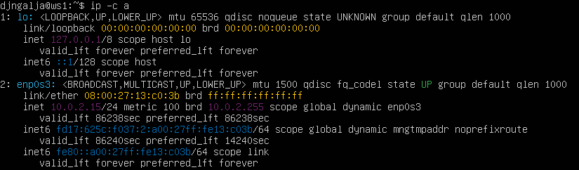  
    - __ws2__  
      
- Edited respective `/etc/netplan/00-installer-config.yaml` files. Set the following addresses and masks:
    - __192.168.100.10/16__ for __ws1__  
    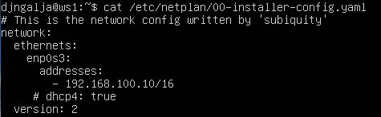  
    - __172.24.116.8/12__ for __ws2__  
    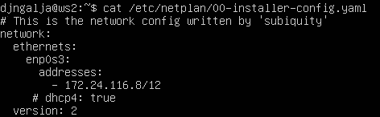  
- Used `sudo netplan apply` command to restart the network service:  
  

__2.1. Adding a static route manually__
- Added a static route from one machine to another and back using `ip r add [IP address] dev enp0s3` command.
- Pinged the connection between the machines:
    - __ws1__  
    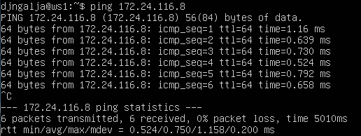  
    - __ws2__  
    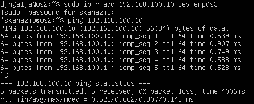  

__2.2. Adding a static route with saving__
- Restarted the machines using `reboot`.
- Edited the respective `/etc/netplan/00-installer-config.yaml` files to add static routes from one machine to another. For this reason, added `routes` property:
    - __ws1__  
    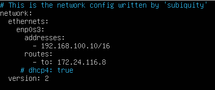  
    - __ws2__  
    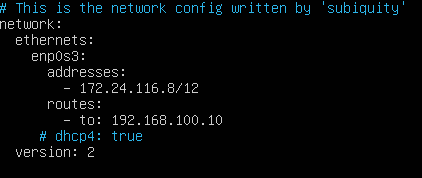  
- Using `sudo netplan apply`, applied the __netplan__ and pinged the connection between the machines:
    - __ws1__  
    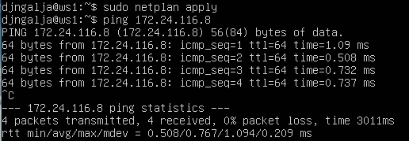  
    - __ws2__  
    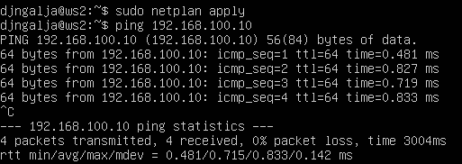  

## Part 3. __iperf3__ utility
__3.1. Connection speed__
- 8 Mbps = `1 MB/s`
- 100 MB/s = `800 000 Kbps`
- 1 Gbps = `1000 Mbps`

__3.2. __iperf3__ utility__
- Using __iperf3__ utility, measured connection speed between __ws1__ and __ws2__. 
    - On __ws1__, started an __iperf3__ server using a __-s__ option. Additionally, used a __-f__ option to set format (__M__ = Mbits).  
    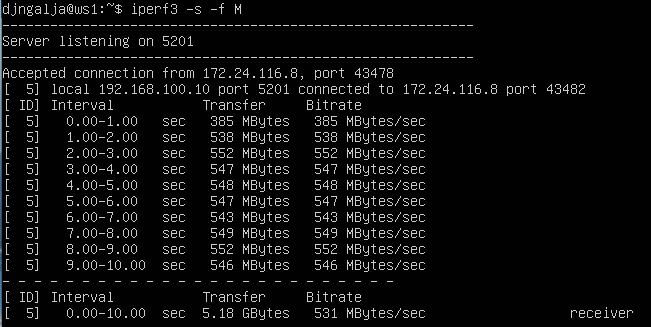  
    - On __ws2__, started __iperf3__ in client mode using a command-line option __-c__ and an IP address of a host to which __iperf3__ should connect (`192.168.100.10`).  
    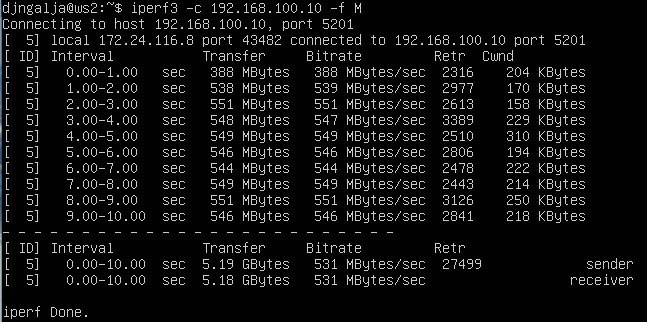  
- Based on the results, the average connection speed is `531 MB/s`.

## Part 4. Network firewall
__4.1. __iptables__ utility__
- Created a `/etc/firewall.sh` file simulating the firewall on __ws1__ and __ws2__.
- Set up __port forwarding__ on the virtual machine to open ports __22 (ssh)__ and __80 (http)__.
- On __ws1__, applied a strategy where a deny rule is written at the beginning and an allow rule is written at the end. For this reason, at first rejected (no ping) and then allowed `echo reply`. The contents of file `/etc/firewall` for __ws1__:  
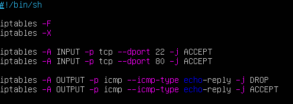  
- On __ws2__, applied a strategy where an allow rule is written at the beginning and a deny rule is written at the end. For this reason, at first allowed and then rejected `echo reply`. The contents of file `/etc/firewall` for __ws2__:  
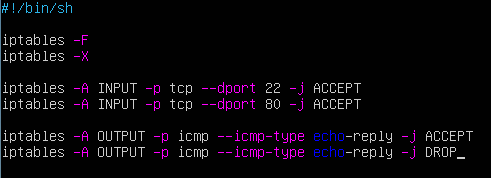  
- Ran the files using `sudo chmod +x /etc/firewall.sh` and `sudo /etc/firewall.sh`:
    - __ws1__  
    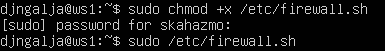  
    - __ws2__  
      
- After pinging the machines (_see 4.2_), it became clear that the 1st strategy blocks all __ICMP echo reply__ packets and the __ACCEPT__ rule that comes next is never taken into account. Thus, __ws1__ becomes unavailable for pinging.
- On __ws2__, the 1st rule is applied to all __ICMP echo reply__ packets, therefore, the machine is available for pinging.

__4.2. __nmap__ utility__
- Using `ping` command, found a machine that cannot be pinged (__ws1__):  
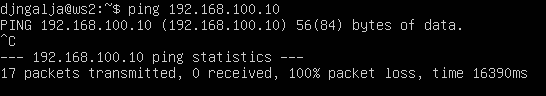  
-  However, using __nmap__ utility, it is possible to show that the machine __ws1__ is up:  
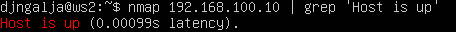  
- Created __VirtualBox__ SnapShots of the machines.

## Part 5. Static network routing
- Started 5 virtual machines (3 workstations (__ws11__, __ws21__, __ws22__) and 2 routers (__r1__, __r2__)).

__5.1. Configuration of machine addresses__
- Set up the machine configurations in respective `/etc/netplan/00-installer-config.yaml` files:
    - __ws11__  
    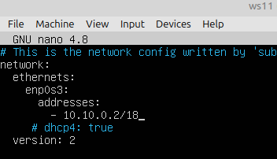  
    - __ws21__  
    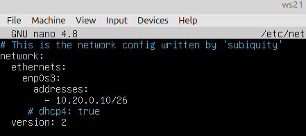  
    - __ws22__  
    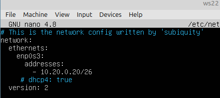  
    - __r1__  
    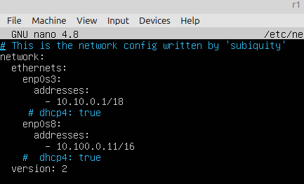  
    - __r2__  
    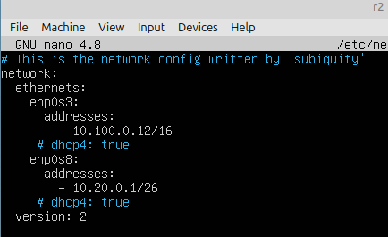  
- Restarted the network service for each machine using `sudo netplan apply`. 
- Using `ip -4 -c a`, checked the machine IP addresses:
    - __ws11__  
    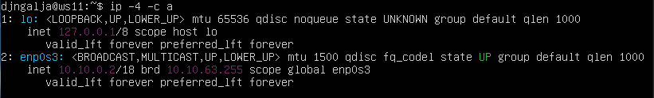  
    - __ws21__  
    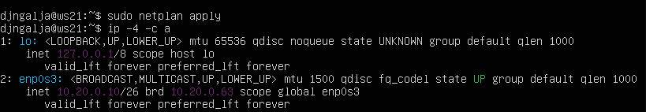  
    - __ws22__  
      
    - __r1__  
    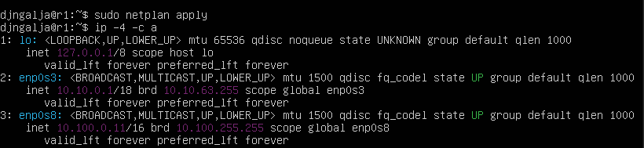  
    - __r2__  
    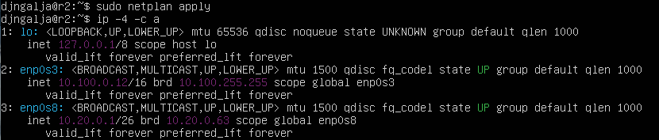  
- Successfully pinged __ws22__ from __ws21__:   
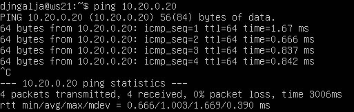  
- Successfully pinged __r1__ from __ws11__:  
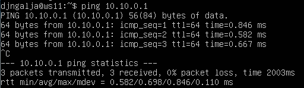  

__5.2. Enabling IP forwarding__
- To enable IP forwarding, ran `sudo sysctl -w net.ipv4.ip_forward=1` on the routers:
    - __r1__  
    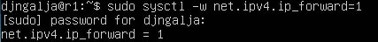  
    - __r2__  
    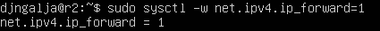  
- To make IP forwarding work after the system is rebooted, edited a `/etc/sysctl.conf` file on the routers:  
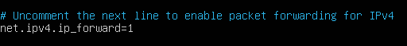  

__5.3. Default route configuration__
- Configured the default route (gateway) for the workstations. To do this, added __default__ before the router's IP in the configuration file:
    - __ws11__  
    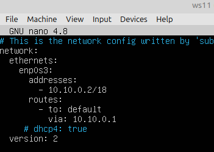  
    - __ws21__  
    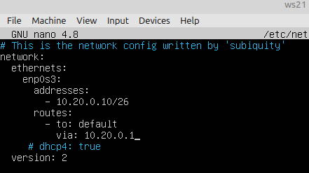  
    - __ws22__  
    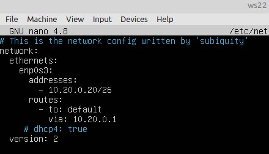  
- Using `ip -c r`, made sure that the routes were added to the routing table:
    - __ws11__  
    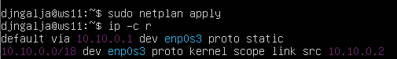  
    - __ws21__  
    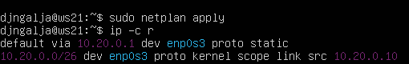  
    - __ws22__  
    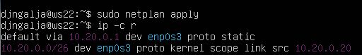  
- Pinged __r2__ router from __ws11__. The route to __ws11__ is unknown, thus the ping packets cannot return:   
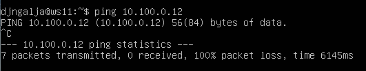  
- However, using `sudo tcpdump -tn -i enp0s3`, it is possible to check that the ping messages are reaching  __r2__:  
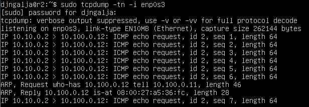  

__5.4. Adding static routes__
- Added static routes to __r1__ and __r2__ by editing the respective `/etc/netplan/00-installer-config.yaml` configuration files:  
    - __r1__  
    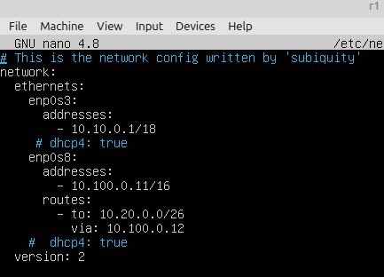  
    - __r2__  
    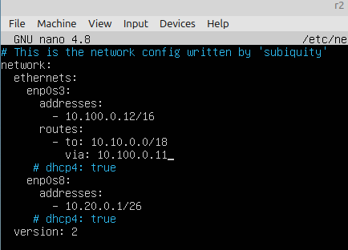  
- Using `ip -c r` command, made sure that the routes were added to the respective routing tables:
    - __r1__  
    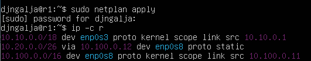  
    - __r2__  
    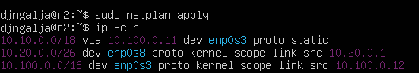  
- On __ws11__, ran `ip -c r list 10.10.0.0/18` and `ip -c r list 0.0.0.0/0`:
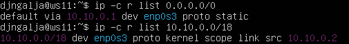  
- Despite the fact that the address `10.10.0.0/18` falls under the default route, another route was selected. This happened because the route was selected by matching the IP address with entries in the routing table, prioritizing the most specific match.

__5.5. Making a router list__
- Ran on __r1__ the following command: `sudo tcpdump -tnv -i enp0s3 > tcpdump.txt`.
- To list routers in the path from __ws11__ to __ws21__, used `traceroute` utility with the IP address of __ws21__ (`10.20.0.10`) on __ws11__ machine:  
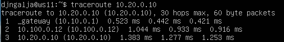  
- __traceroute__ uses the __ttl__ (time to live) field of ICMP Echo Request packets. This is the number of routers the packets can traverse before being discarded. Every time a packet reaches a router, the router decreases the value of __ttl__ by 1. When the value of __ttl__ reaches 0, the router discards the packet and sends back an __ICMP time exceeded in-transit__ message. 
- __traceroute__ sends the first packet with a __ttl__ of 1. When this packet reaches the first router, the router decrements the __ttl__ by 1, discards the packet and sends back an __ICMP time exceeded in-transit__ message. Thus, __traceroute__ gets the address of the first router and the time required to reach it. __traceroute__ then sends another packet with a __ttl__ of 2. This packet reaches the first router, then the second router that discards it and sends back the __ICMP time exceeded in-transit__ message. Thus, __traceroute__ gets the address of the second router and so on. This process continues until the packets reach the destination. In this case,  instead of the __ICMP time exceeded in-transit__ message, the source gets back a __port unreachable__ message:  
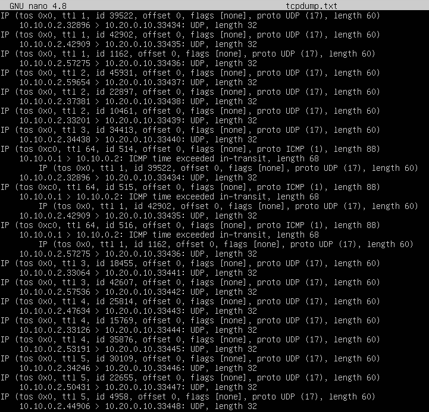  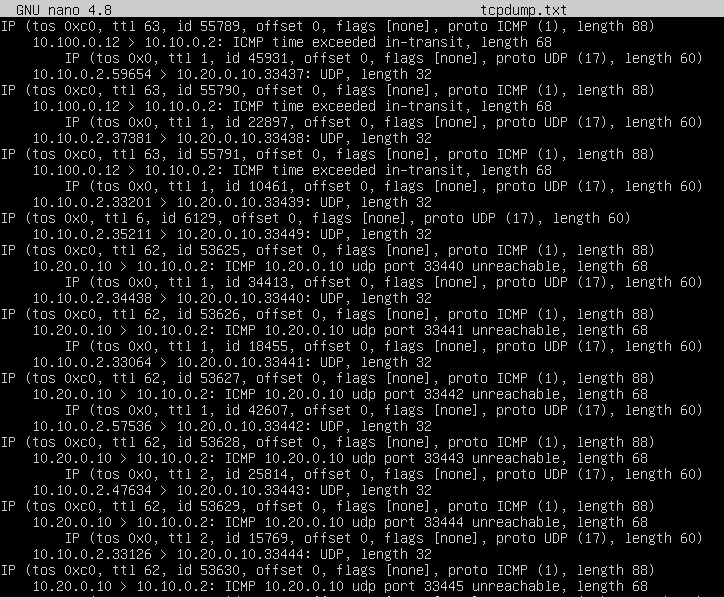 

__5.6. Using __ICMP__ protocol in routing__
- On __r1__, ran network traffic capture going through __enp0s3__ using `sudo tcpdump -n -i enp0s3 icmp`:  
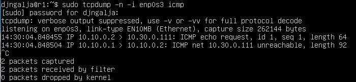  
- Pinged a non-existend IP (10.30.0.111) from __ws11__ using `ping -c 1 10.30.0.111`:  
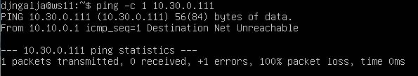  
- Created __VirtualBox__ SnapShots of the machines.

## Part 6. Dynamic IP configuration using __DHCP__
- Configured the __DHCP__ service on __r2__:
    - In the `/etc/dhcp/dhcpd.conf` file, specified the default router address, DNS-server and internal network address:  
    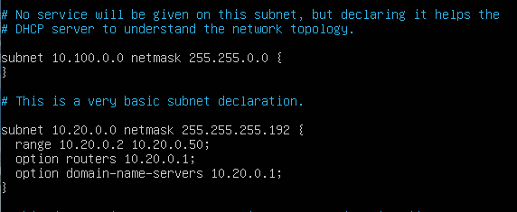  
    - Added `nameserver 8.8.8.8` to the file `resolv.conf`:  
    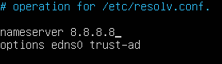  
    - Restarted the __DHCP__ service using `systemctl restart isc-dhcp-server`:  
      
- Tested the __DHCP__ service on __r2__:
    - On __ws21__, edited the `etc/netplan/00-installer-config.yaml` configuration file to enable dynamic IP addressing. Rebooted __ws21__ using `reboot`. By running `ip -c a`, made sure that it had got a new address:  
      
    - Successfully pinged __ws22__ from __ws21__:  
      
- For __ws11__, specified a MAC address by adding the `macaddress: 10:10:10:10:10:BA` and `dhcp4: true` lines to the `etc/netplan/00-installer-config.yaml` file:  
  
- Configured __r1__ the same way as __r2__ but made the assignment of addresses strictly linked to the MAC address (__ws11__):
    - In the `/etc/dhcp/dhcpd.conf` file, configured the __DHCP__ service:  
      
    - Linked the assignment of addresses to the MAC address by editing the same file (__ws11__):  
      
    - Added `nameserver 8.8.8.8` to the file `resolv.conf`:  
      
    - Restarted the __DHCP__ service using `systemctl restart isc-dhcp-server`:  
      
- Similar to __r2__, tested the __DHCP__ service on __r1__:
    - Rebooted __ws11__ using `reboot`. By running `ip -c a`, made sure that it had got a new address:  
      
    - Successfully pinged __ws22__ с __ws11__:  
      
- Requested IP address update from __ws21__. 
    - The Network interfaces on __ws21__ before the update:  
      
    - Using the `sudo dhclient -r enp0s3` command, released the current IP address of the __enp0s3__ network interface.
    - By running `sudo dhclient enp0s3` command, got a new IP address for the interface:  
      
- Created __VirtualBox__ SnapShots of the machines.

## Part 7. __NAT__
- In the `/etc/apache2/ports.conf` file changed the line `Listen 80` to `Listen 0.0.0.0:80` to make the __Apache2__ server public:
    - On __ws22__:  
      
    - On __r1__:  
      
- Started the __Apache__ web server by running `service apache2 start`:
    - On __ws22__:  
      
    - On __r1__:  
      
- Similar to [Part 4](#part-4-network-firewall), created a firewall on __r2__. Added the following rules to the firewall:
    - Delete rules in the __filter__ table — `iptables -F`
    - Delete rules in the __NAT__ table — `iptables -F -t nat`
    - Drop all routed packets  — `iptables --policy FORWARD DROP`
- Executed the file:  
  
- Checked the connection between __ws22__ and __r1__ using `ping`. As expected, following the rules in the firewall file, __ws22__ cannot be pinged from __r1__:  
  
- Added another rule to the file to allow routing of all __ICMP__ packets:
    - On __r2__, added `iptables -A FORWARD -p icmp -j ACCEPT` to the file `/etc/firewall.sh`.
    - Similar to [Part 4](#part-4-network-firewall), executed the file.
    - Checked the connection bewteen __ws22__ and __r1__ using `ping`. As expected, following the updated rules in the firewall file, __ws22__ can be successfully pinged from __r1__:  
      
- Added 2 more rules to the file:
    - Enabled __SNAT__ to masquerade all local IPs from the local network behind __r2__ (network 10.20.0.0) by adding the `iptables -t nat -A POSTROUTING -o enp0s3 -j MASQUERADE` line. To make it work, additionally, enabled the forwarding of inner packets (`iptables -A FORWARD -i enp0s8 -o enp0s3 -j ACCEPT` line) and all related and established traffic (`iptables -A FORWARD -i enp0s3 -m state --state RELATED,ESTABLISHED -j ACCEPT` line).
    - Enabled __DNAT__ on port 8080 of __r2__ machine and added external network accesss to the Apache web server running on __ws22__: `iptables -t nat -A PREROUTING -p tcp --dport 8080 -j DNAT --to-destination 10.20.0.20:80`. To make it work, added 1 more line: `iptables -A FORWARD -p tcp --dport 80 -j ACCEPT`.  
      
    - Similar to [Part 4](#part-4-network-firewall), executed the file.
- Checked the __TCP__ connection for __SNAT__ by connecting from __ws22__ to the __Apache__ server on __r1__ using the `telnet 10.10.0.1 80` command:  
  
- Checked the __TCP__ connection for __DNAT__ by connecting from __r1__ to the __Apache__ server on __ws22__ using the `telnet 10.20.0.1 8080` command (the address of __r2__ and port 8080):  
  
- Created __VirtualBox__ SnapShots of the machines.

## Part 8. Introduction to __SSH Tunnels__
__1. Run a firewall on r2 with the rules from Part 7.__
- On __r2__, executed the firewall file from [Part 7](#part-7-nat) by running `sudo /etc/firewall.sh`:  
  

__2. Start the __Apapche__ web server on ws22 on localhost only (i.e. in _/etc/apache2/ports.conf_ file change the line `Listen 80` to `Listen localhost:80`).__
- On __ws22__, changed the line `Listen 80` to `Listen localhost:80` in the `/etc/apache2/ports.conf` file.
- Started the __Apache__ web server by running `service apache2 start`:  
  

__3. Use _Local TCP forwarding_ from ws21 to ws22 to access the web server on ws22 from ws21.__
- On __ws21__, ran `ssh -L 8080:localhost:80 djngalja@10.20.0.20`:  
  
- To check the connection, opened a second terminal (by pressing `Alt + F2`) and ran `telnet 127.0.0.1 8080`:  
  

__4. Use _Remote TCP forwarding_ from ws11 to ws22 to access the web server on ws22 from ws11.__
- On __ws22__, ran `ssh -R 10.10.0.2:8080:localhost:80 -N -f djngalja@10.10.0.2`:  
  
- To check the connection, ran `telnet 127.0.0.1 8080` on __ws11__:  
  
- Created __VirtualBox__ SnapShots of the machines.