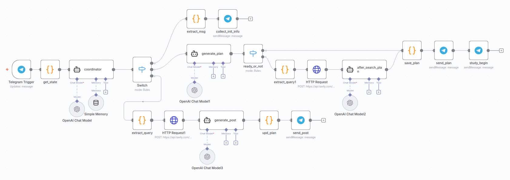

# AI-powered Telegram Learning Assistant

An n8n-based bot that creates personalized learning plans and delivers content via Telegram. Built as a multi-agent AI system, it generates customized study plans based on user requests, delivers educational content with up-to-date information from Tavily, and automatically tracks learning progress.

## Features
- **Personalized Learning Plans**: Creates structured plans
- **Progress Tracking**: Automatically advances through topics
- **Up-to-Date Content**: Integrates live search results

## How it works
1. **Initial contact**: Telegram bot greets user and collects learning preferences
2. **Plan Creation**: Generates structured learning plan with topics and subtopics
3. **Content Delivery**: Delivers educational posts one by one
4. **Progress Tracking**: Automatically advances to next topic after each interaction
5. **Smart Completion**: Deletes plan when all topics are completed

## Setup
1. **Import Workflow**: Import `Telegram_AI_tutor_bot.json` into your n8n workflow

2. **Configure Credentials**: 
- Add Telegram API credential
- Add Tavily API credential
- Add OpenAI credential
3. **Activate Workflow**
