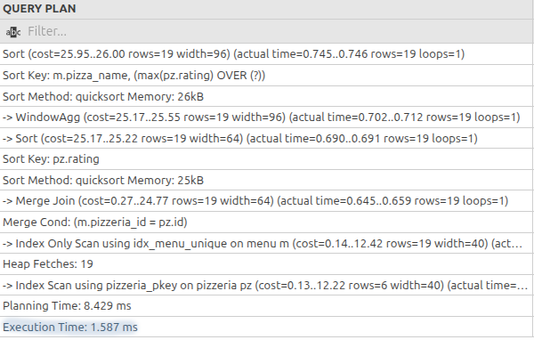
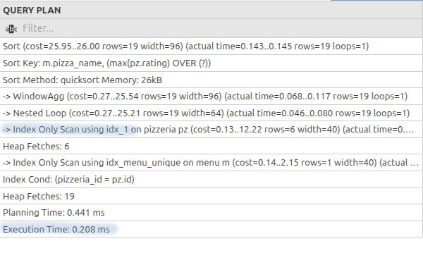
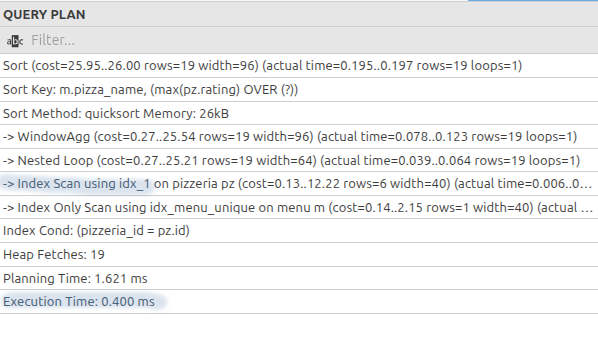

## ex06 — Performance improvement

- Analysed the following SQL-query:
```
SELECT
    m.pizza_name AS pizza_name,
    max(rating) OVER (PARTITION BY rating ORDER BY rating ROWS BETWEEN UNBOUNDED PRECEDING AND UNBOUNDED FOLLOWING) AS k
FROM  menu m
INNER JOIN pizzeria pz ON m.pizzeria_id = pz.id
ORDER BY 1,2;
```
- The result __BEFORE__ creating a B-Tree index: <br />
 <br />
- Created the following B-Tree index __idx_1__:
```
CREATE INDEX IF NOT EXISTS idx_1 ON pizzeria (rating, id);
```
- The result __AFTER__ optimisation:<br />
 <br />
- Another option:
```
CREATE INDEX IF NOT EXISTS idx_1 ON pizzeria (rating);
```
- The result __AFTER__:<br />
 <br />